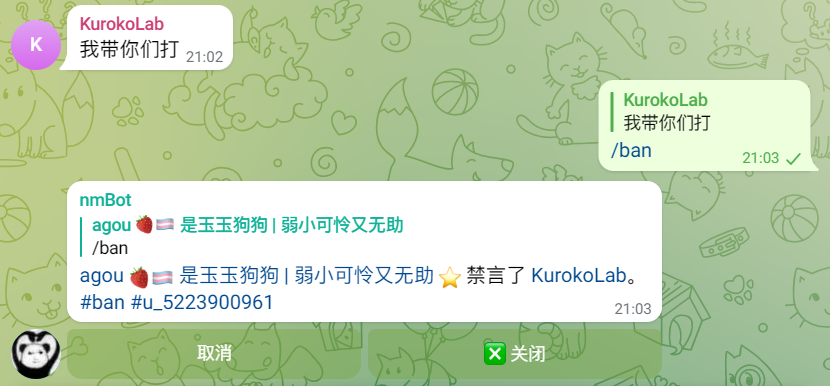
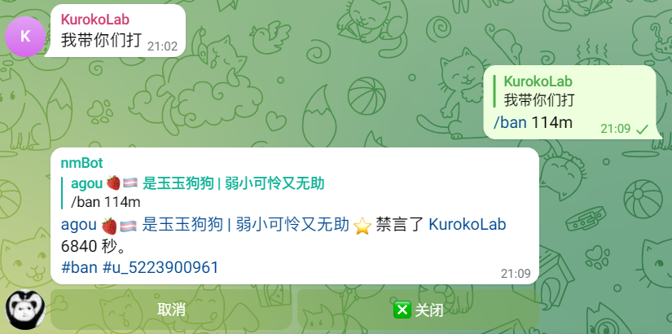
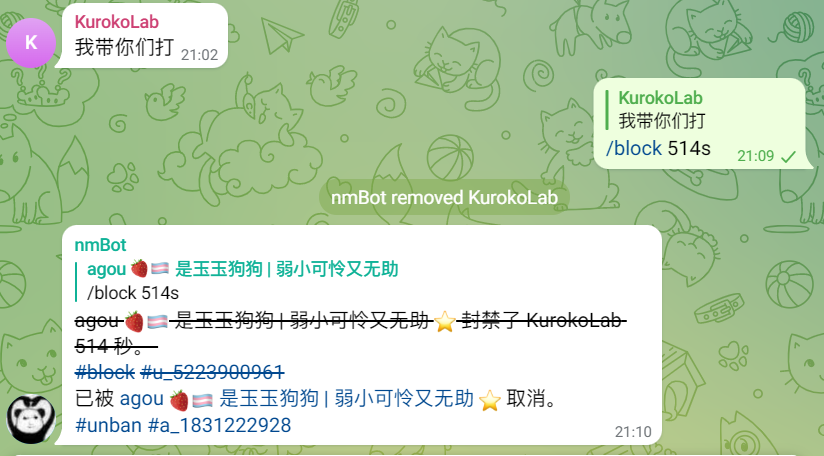

# 使用 ban、block 指令禁言或封禁成员和频道

使用 ban 和 block 指令，可以在群组中禁言或封禁成员和频道。  

>💡 `/ban`（禁言）将使群组成员永久或在一段时间内无法在群组中发送消息；`/block`（封禁）将使群组成员被移出群组，且无法查看群组信息和消息，或使成员无法使用他的频道身份发言。

## 参数

`/ban` 和 `/block` 支持如下参数：

| 参数名称 | 参数说明 |
|:---|:---|
| （回复消息） | 将该消息的发布者视作处理对象。 |
| 在指令后紧跟的用户 ID、频道 ID 或 username | 若没有回复消息，则将传入的参数视作处理对象。 由于 Telegram 限制，暂不支持使用用户 username 提及用户。|
| 在指令后（若未传入用户信息参数）或用户信息参数后（若传入了用户信息参数）紧跟的时间 | 支持使用 s (秒), m (分钟), h (小时), d (天), w (周), M (月)作为时间单位，若没有单位则按秒计算，若未传入、传入时间小于 30 秒或大于 366 天，则视为永久禁言。|

>💡 仅当 nmBot 返回消息确认操作成功时，才能表明限制成功。  

>💡 群组管理员可以在 nmBot 的返回消息中执行取消禁言或删除返回消息等快捷操作。
{ width: 200 }

>💡 群组管理员可以回复 nmBot 的返回消息指令，直接对返回消息中的用户进行禁言和封禁，等同于直接回复用户的消息。

此功能需要操作者拥有封禁用户权限。

## 实例

<figure markdown>

<figcaption>使用 ban 指令</figcaption>
</figure>
<figure markdown>

<figcaption>使用 ban 指令设置禁言时间</figcaption>
</figure>
<figure markdown>

<figcaption>使用 block 指令设置封禁时间并通过按钮取消禁言</figcaption>
</figure>
