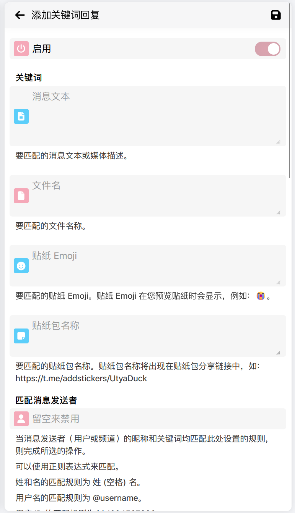
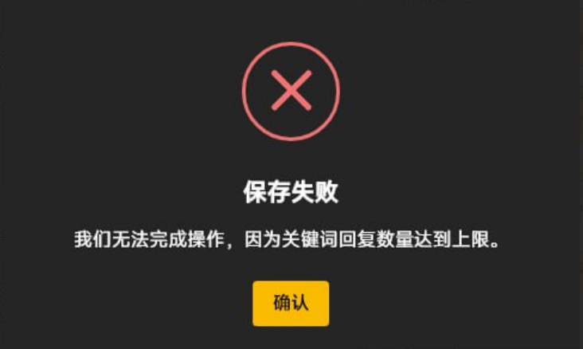

# 关键词回复

“关键词回复”功能允许您“监听”群组中的消息内容或发送消息的人。当群组中的新消息符合您设置的监听条件时，nmBot 将自动回复消息或执行您预设的操作。

## 如何设置关键词回复

您可以通过 [nmBot 面板](../panel.md)管理群组的关键词回复。

## 了解关键词回复设置中可用的设置项



关键词回复包含一系列自定义设置，以满足您的需求。以下是您可以设置的选项：

### 启用

是否要启用当前关键词回复。如果关闭此选项，nmBot 将不会对符合条件的消息进行回复。

### 消息文本

要匹配的消息文本或发送媒体的描述文本。您可以使用正则表达式来匹配文本。

### 文件名

要匹配的文件名。您可以使用正则表达式来匹配文件名。

### 贴纸 Emoji

要匹配的贴纸的 Emoji。您可以使用正则表达式来匹配 Emoji。

要查看贴纸的 Emoji，请在 Telegram 中打开贴纸包界面，然后长按要查看的贴纸，查看显示在预览上方的 Emoji。

### 贴纸包名称

要匹配的贴纸包名称。您可以使用正则表达式来匹配贴纸包名称。

要查看贴纸包名称，请在 Telegram 中打开贴纸包界面，然后选择共享此贴纸包并拷贝共享链接。

链接看起来像这样：`https://t.me/addstickers/UtyaDuck`，其中 `UtyaDuck` 就是贴纸包名称。

!!! note
请不要将贴纸包名称与贴纸包标题混淆。贴纸包标题是显示在贴纸包界面上方的名称。

### 匹配消息发送者

您可以匹配消息的发送者。当消息发送者的信息匹配该规则时，则完成所选的操作。

可以使用正则表达式来匹配。

姓和名的匹配规则为 姓 (空格) 名。

用户名的匹配规则为 @username。

用户 ID 的匹配规则为 id:1234567890。

要匹配 Telegram Premium 用户，请使用 {is_premium}。

以下是示例：

```
张 三 // 匹配姓名为“张 三”的用户
@nmbotchannel // 匹配用户名为“nmbotchannel”的用户
id:20210614 // 匹配用户 ID 为 20210614 的用户
张|id:20210614 // 匹配姓名为“张”的用户或用户 ID 为 20210614 的用户
```

### 匹配转发者名称

您可以匹配消息的转发者。当消息转发者的信息匹配该规则时，则完成所选的操作。

可以使用正则表达式来匹配。

### 独立匹配

此选项控制“消息文本”“文件名”“贴纸 Emoji”“贴纸包名称”这个选项大类和“匹配消息发送者”和“匹配转发者名称”这个选项大类之间是“与”还是“或”的关系。

若此选项开启，则为“与”的关系，也就是说，只有当“消息文本”“文件名”“贴纸 Emoji”“贴纸包名称”之一满足条件**且**“匹配消息发送者”和“匹配转发者名称”之一满足条件时，才会触发关键词回复。

若此选项关闭，则为“或”的关系，也就是说，只要“消息文本”或“文件名”或“贴纸 Emoji”或“贴纸包名称”**或**“匹配消息发送者”或“匹配转发者名称”满足条件时，就会触发关键词回复。也就是说，只要全部设置项中其中一个选项满足条件，就会触发关键词回复。

例如，小明通过关键词回复对成员`小红`进行制裁，只要小红在群组中发送`脏话`就对小红发送消息，但其他成员发送`脏话`不会触发关键词回复，小红未发送脏话时，也不会触发关键词回复。

在这种情况下，`消息文本`为`脏话`，`匹配消息发送者`为`小红`，`独立匹配`为开启。

再如，小刚要整治群组中发送脏话的不正之风，只要群组中有人发送`脏话`或者是名字里有`脏`字的人发送消息，就对他们触发关键词回复。

在这种情况下，`消息文本`为`脏话`，`匹配消息发送者`为`脏`，`独立匹配`为关闭。

### 回复

你可以在“选择模板”区域中选择要触发的回复内容的消息模板。若看不到已经设置的消息模板，请确保“其他模板”标题右侧的眼睛按钮上没有划斜杠。

点按右上角的加号按钮，可以添加新的消息模板。

### 触发条件

在此可以选定一些高级触发条件，包括：

- **忽略群组管理员**：不对群组管理员触发关键词回复。
- **匹配编辑后的消息**：对编辑后的消息进行匹配。
- **忽略拉丁文字母大小写**：不区分拉丁文字母的大小写。例如，`Hello` 和 `hello` 将被视为相同的文本。
- **忽略中文字符简繁体**：不区分中文字符的简繁体。例如，`开心` 和 `開心` 将被视为相同的文本。
- **冷却时间**：在某个用户触发关键词回复后，暂时禁止该用户再次触发关键词回复的时间。可以避免用户恶意触发关键词回复刷屏。

### 随机回复

若启用“随机回复”功能，nmBot 将从您设置的多个回复模板中随机选择一个回复。

默认情况下，nmBot 将按照您设置的顺序依次发送回复。若启用“随机回复”功能，nmBot 将随机选择一个回复发送。

### 自动删除

你可以设置在一段时间后自动删除用户发送的，触发关键词回复的消息（**触发消息**）以及 nmBot 发送的**回复消息**。

### 添加确认按钮

若启用“添加确认按钮”功能，nmBot 将在发送的回复消息中，为用户添加一个确认按钮。用户可以通过点击确认按钮来确认回复消息，随后回复消息将被自动删除。

### 对回复消息禁用 nmartChat

若启用“对回复消息禁用 nmartChat”功能，nmBot 将不会对回复此关键词回复的回复消息触发 nmartChat。
此功能不支持通过“拷贝消息”设置的消息模板。

### 禁言用户

若启用“禁言用户”功能，nmBot 将对触发关键词回复的用户进行禁言。

您可以设置禁言时间或选择永久禁言。对于发送消息的频道身份，仅支持永久禁言。

## 遇到问题

设置关键词回复时可能遇到问题。以下是一些常见问题的解决方法：

### 提示“我们无法完成操作，因为关键词回复数量达到上限。”



这意味着您的群组中的关键词回复数量已达到上限。您可以删除一些不再需要的关键词回复，以便添加新的关键词回复。

### 页面提示“我们无法完成操作，因为关键词回复设置不合法。”

这意味着您的关键词回复设置不符合规则。常见问题有：

- “消息文本”“文件名”“贴纸 Emoji”“贴纸包名称”“匹配消息发送者”“匹配转发者名称”全部为空。
- “消息文本”“文件名”“贴纸 Emoji”“贴纸包名称”“匹配消息发送者”或“匹配转发者名称”为正则表达式，但正则表达式不合法。您需要检查正则表达式是否正确。您可以通过页面输入框下方的提示来检查正则表达式是否正确。
