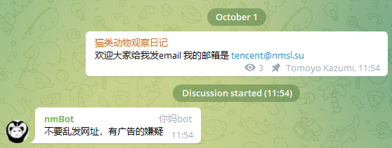

# 同频气氛组  

!!! note "功能介绍"
    使用“同频气氛组”功能可以使 nmBot 第一时间根据消息内容回复群组关联频道发送的消息，增强频道和关联群组的聊天氛围。

您可以在 nmBot `/config` 菜单和 nmBot 面板启用“同频气氛组”功能。

- 未启用“同频气氛组”功能时，nmBot 即使在关联频道广播消息内容中含有 nm 或 nmBot 时也不会触发 nmartChat；  
- 启用后，nmBot 将在群组关联频道广播包含文本或贴纸的消息后，通过 nmartChat 识别回复消息。
!!! success "启用“同频气氛组”功能实例"
      

## 选择同频气氛组语气偏好

nmBot 同频气氛组现已支持选择语气偏好。
您可以在 nmBot `/config` 菜单和 nmBot 面板中设置 nmBot 回复频道消息的语气偏好。

目前支持的语气偏好有：

| 语气偏好 | 描述 |
| --- | --- |
| 随机（默认） | nmBot 将随机选择以下回复频道消息的语气。 |
| 称赞 | nmBot 将赞同频道消息的内容。 |
| 讽刺 | nmBot 将使用反对和讽刺的语气回复频道消息。 |
| 热情 | nmBot 将使用热情的语气回复频道消息。 |
| 猫娘 | nmBot 将使用猫娘语气回复频道消息。 |
| 病娇 | nmBot 将使用病娇语气回复频道消息。 |

> **若发现您不希望 nmBot 回复时，nmBot 回复了您群组关联频道发送的消息，请您检查您或其它管理员是否误打开了“同频气氛组”功能**。
> 由于 nmartChat 的限制策略短时间内可能只有一条消息收到回复。
