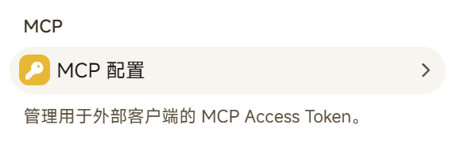
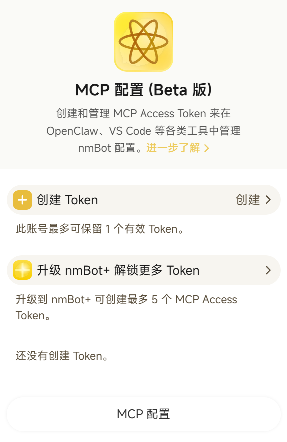
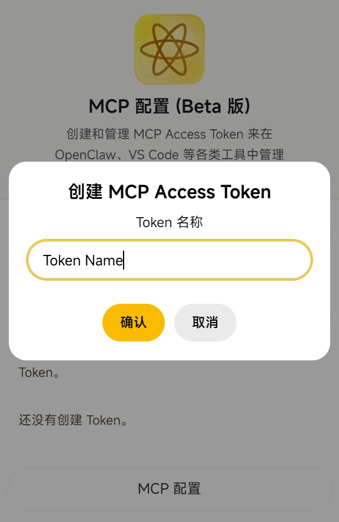
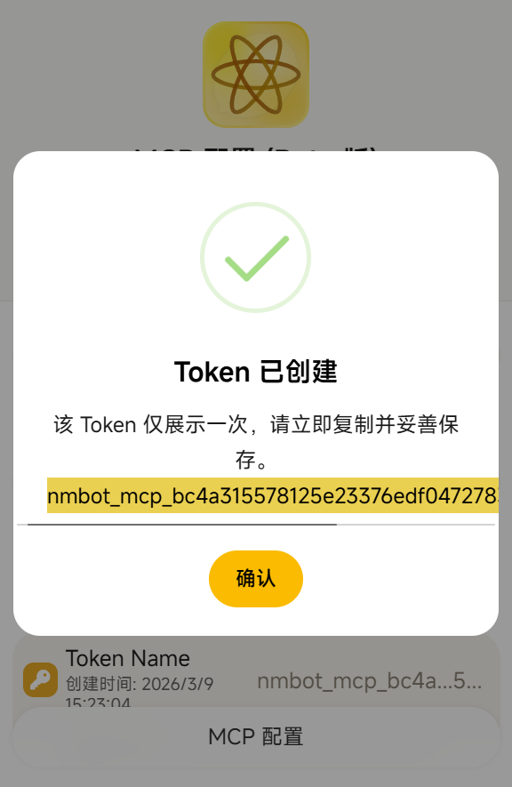
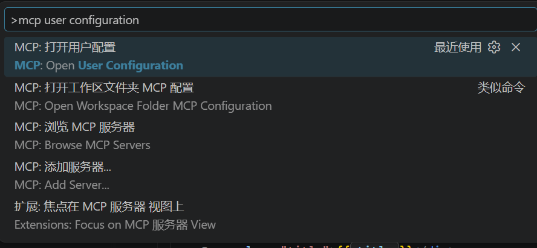
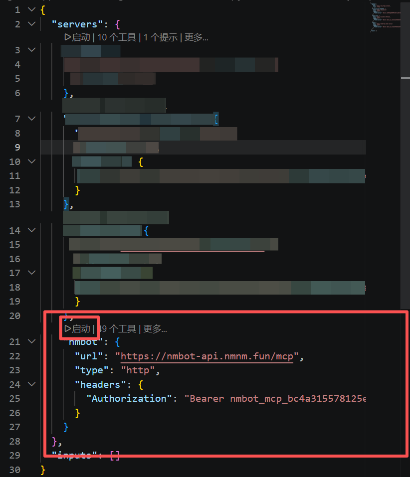

# MCP 配置 (Beta 版)

`MCP 配置` 用于创建和管理 `MCP Access Token`，让您在 `OpenClaw`、`VS Code` 等支持 MCP 的工具中接入 nmBot。

## MCP 配置可以做什么

通过 nmBot MCP，您可以：

- 在支持 MCP 的客户端中接入 nmBot。
- 用 `MCP Access Token` 安全连接 nmBot 能力。
- 在电脑端工具中更方便地完成相关操作。

## 使用前须知

在开始前，请先确认以下事项：

- 您可以正常打开 nmBot 面板。
- `MCP Access Token` 仅会完整显示一次，请在创建后立即复制并妥善保管。
- 普通账号最多可保留 `1` 个有效 Token。
- 升级到 `nmBot+` 后，最多可创建 `5` 个 MCP Access Token。
- `MCP 配置` 当前为 `Beta 版`，界面和细节可能会继续调整。

## 在哪里打开 MCP 配置

您可以在 nmBot 面板中找到 `MCP 配置` 入口。



{ width="360" }

## 创建 MCP Access Token

请按以下步骤操作：

1. 打开 nmBot 面板中的 `MCP 配置` 页面。
2. 点击 `创建 Token`。
3. 在弹出的窗口中输入一个便于识别的 `Token 名称`，例如 `My VS Code`。
4. 点击 `确认`。
5. 创建成功后，系统会弹出提示框并展示完整 Token。
6. 立即复制该 Token，并保存在安全的位置。

{ width="360" }

## 创建后会看到什么

Token 创建成功后，完整 Token 只会展示这一次。返回列表后，通常只能看到 Token 名称、创建时间，以及经过部分隐藏的 Token 内容。

{ width="360" }

## 在 VS Code 中使用 nmBot MCP

请按以下步骤配置。

### 1. 打开 MCP 用户配置

在 VS Code 中打开命令面板，然后输入：

- `MCP: 打开用户配置`
- 或 `MCP: Open User Configuration`

如果这是您个人长期使用的配置，通常更适合放在用户配置中。



### 2. 添加 nmBot MCP 服务器配置

在打开的 MCP 配置文件中，加入类似下面的内容：

```json
{
  "servers": {
    "nmbot": {
      "url": "https://nmbot-api.nmnm.fun/mcp",
      "type": "http",
      "headers": {
        "Authorization": "Bearer <你的 MCP Access Token>"
      }
    }
  }
}
```

{ width="720" }

请注意：

- 将 `<你的 MCP Access Token>` 替换为真实 Token。
- `Authorization` 中的 `Bearer` 前缀需要保留。
- 如果已存在其他 `servers`，请把 `nmbot` 合并进去。

### 3. 保存并检查是否已加载

保存配置后，可用以下入口检查是否已生效：

- `MCP: 浏览 MCP 服务器`
- `MCP: Browse MCP Servers`
- `扩展: 焦点在 MCP 服务器视图上`

配置正确时，nmBot 服务器通常会出现在列表中，并显示可用工具数量。

## 在 OpenClaw 中使用 nmBot MCP

根据 OpenClaw 文档，OpenClaw 当前通常通过 `mcporter` 或 `mcp-remote` 这样的桥接方式接入远程 MCP 服务，而不是直接填写一个 `url` 类型的 HTTP MCP 服务器。可参考[OpenClaw 文档](https://docs.openclaw.ai/getting-started)与 [mcp-remote 文档](https://www.npmjs.com/package/mcp-remote)。

如果您在 OpenClaw 当前使用的 MCP 客户端配置中看到 `mcpServers` 字段，可参考下面这种写法：

```json
{
  "mcpServers": {
    "nmbot": {
      "command": "npx",
      "args": [
        "-y",
        "mcp-remote@latest",
        "https://nmbot-api.nmnm.fun/mcp",
        "--header",
        "Authorization:${NMBOT_AUTH_HEADER}",
        "--transport",
        "http-only"
      ],
      "env": {
        "NMBOT_AUTH_HEADER": "Bearer <你的 MCP Access Token>"
      }
    }
  }
}
```

请注意：

- 该示例基于 OpenClaw 的 `mcpServers` 命令式配置格式，以及 `mcp-remote` 官方文档中的 `--header` 用法。
- 这里把 `Bearer <token>` 放进环境变量，避免直接在 `args` 中写带空格的完整认证头。
- `--transport http-only` 用于明确按 HTTP 方式连接 nmBot MCP。
- 不同版本的 OpenClaw、acpx 或外部 MCP 客户端，配置位置可能不同，请以当前环境中的 OpenClaw 文档为准。

如果您希望接入 `nmBot Preview MCP`，可将上面示例中的地址替换为：

- `https://nmbot-preview-api.nmnm.fun/mcp`

### OpenClaw 配置位置

OpenClaw 文档说明其主配置默认位于 `~/.openclaw/openclaw.json`，并使用 `JSON5` 格式。

如果您不确定当前实际读取的是哪个配置文件，可先执行：

```bash
openclaw config file
```

如果您的 OpenClaw 安装或配套 MCP 客户端支持在该配置体系中维护 `mcpServers`，通常可以在那里查找或编辑对应条目。

### OpenClaw 排错建议

如果 OpenClaw 中的 nmBot MCP 没有正常工作，可依次检查：

- 运行 `openclaw config validate`，确认配置没有语法问题。
- 确认系统已安装可运行 `npx` 的 Node.js 环境。`mcp-remote` 文档要求 Node `18+`。
- 确认 `NMBOT_AUTH_HEADER` 是 `Bearer <你的 MCP Access Token>`，而不是只填 Token 本体。
- 如果改动后仍未生效，重启 OpenClaw 或重新开启相关会话再测试。
- 如果怀疑是 `mcp-remote` 的本地认证缓存异常，可清理 `~/.mcp-auth` 后重新连接。
- 如需进一步排查，可在 `args` 中加入 `--debug`。

## 在其他 MCP 客户端中使用

如果您使用的不是 VS Code，而是其他支持 MCP 的客户端，通常也需要以下信息：

- 服务地址：`https://nmbot-api.nmnm.fun/mcp`
- 连接方式：`HTTP`
- 请求头：`Authorization: Bearer <你的 MCP Access Token>`

不同客户端的配置方式可能不同，但核心信息通常相同。

## 使用 nmBot Preview MCP

如果您希望接入 `nmBot Preview MCP`，请将服务地址改为：

- `https://nmbot-preview-api.nmnm.fun/mcp`

例如，您可以在 VS Code 中加入类似下面的配置：

```json
{
  "servers": {
    "nmbot-preview": {
      "url": "https://nmbot-preview-api.nmnm.fun/mcp",
      "type": "http",
      "headers": {
        "Authorization": "Bearer <你的 MCP Access Token>"
      }
    }
  }
}
```

如果同时需要稳定版与 Preview 版，可以在同一个配置文件中保留两个不同名称的服务器项。

## 速率限制

nmBot MCP 请求存在速率限制，请按您的账号类型留意使用频率：

- 普通用户：每分钟 `5` 次，每小时 `50` 次。
- `nmBot+` 用户：每分钟 `20` 次，每小时 `500` 次。

短时间内请求过多时，客户端可能暂时无法继续请求，需要稍后重试。

## Token 管理建议

建议您：

- 为不同用途使用清晰的 Token 名称，例如 `VS Code`、`OpenClaw`。
- 不要将 Token 发布到公开仓库、群组聊天或公开截图中。
- 不要把完整 Token 直接发送给他人。
- 如果怀疑 Token 已泄露，请尽快处理现有 Token，并在客户端中更新为新的 Token。

## 更多资源

除了 nmBot MCP，我们还发布了 nmBot Agent Skills。用户可通过安装由 nmBot 官方开发的技能，使智能体全面掌握 nmBot 功能，从而更有效地协助用户进行 nmBot 功能配置。nmBot Agent Skills 可通过 GitHub 访问：https://github.com/nm-Team/nmbot-skills

## 常见问题

### 为什么我不能创建多个 Token

普通账号最多只能保留 `1` 个有效 Token。

如果您需要更多 Token，可升级到 `nmBot+`，升级后最多可创建 `5` 个 Token。

### 为什么我在 VS Code 中看不到 nmBot 服务器

请检查以下内容：

- MCP 配置文件中的 JSON 格式是否正确。
- `url` 是否填写为 `https://nmbot-api.nmnm.fun/mcp`。
- `Authorization` 是否包含正确的 `Bearer ` 前缀。
- Token 是否已经完整粘贴，没有多余空格或遗漏字符。
- 您是否把配置写入了正确的用户配置或工作区配置位置。

必要时，重新打开 MCP 配置页面或刷新 VS Code 中的 MCP 服务器视图后再检查一次。

### 为什么我之后看不到完整 Token

这是正常情况。

出于安全考虑，完整 Token 只会在创建成功时显示一次，请务必立即复制保存。

## 相关说明

如果您需要继续了解 nmBot 面板的使用方式，也可以参阅相关文档：

- [如何启动 nmBot 面板](panel/how-to-launch-panel.md)
- [启动 nmBot 面板](launch-panel.md)
