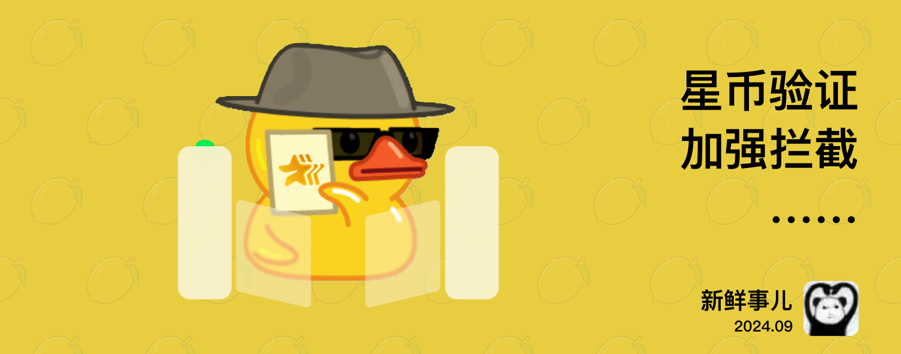

# nmBot 2024 年 9 月功能更新

## 新鲜事儿
### 骚扰拦截新举措、频道管理好工具和更多——2024 年 9 月功能更新

#### 入群验证拦截进化

超过 3,300 个群组正在使用 nmBot 管理新入群成员。有了更大的样本容量，我们发现，许多骚扰用户会在短时间内连续加入多个群组。

在 9 月更新中，启用了入群验证“自动拒绝骚扰用户入群”时，nmBot 会自动拒绝短时间内加入多个群组的用户的所有未完成入群验证。

#### 验证方式也升级

对那些宁可错杀一千也不愿放过一个的群组们，我们新增了一种要求超高的验证方式：星币验证。新成员必须尝试支付一笔星币订单，才能加入群组。他们的星币实际上不会被扣除，但对于那些无法在三分钟内完成支付的人来说就有难了。

#### 其他更新和惊喜

现在，对于已经发布的帖子，您也可以通过 nmBot 面板对其按钮进行编辑了；nmBot 面板的多项操作体验也有新优化。

除了常规优化和修复外，我们还带来了一些让 nmBot 更聪明的改进，不知道你是否能发现呢？

## 2024 年 9 月 18 日 21:42
### 入群验证升级

- 新增入群验证类型“星币验证”。
    - 启用该类型后，用户必须尝试支付 1 星币来验证自己不是机器人。
    - nmBot 将自动中止支付，因此所有用户的星币都不会被扣除。
- 在 /config 菜单和 nmBot 面板增加了“通过对话加入请求验证”选项。关闭该选项后，nmBot 将不再通过对话加入请求进行入群验证。
- 启用入群验证“自动拒绝骚扰用户入群”时，nmBot 会自动拒绝短时间内加入大量群组的用户的所有未完成入群验证并举报。
- 在网页验证的验证消息中添加了在浏览器中打开验证页面的按钮。

### 编辑已发送帖子的按钮

- 您可以在 nmBot 面板编辑频道中已发送帖子的按钮。

### 其他改进

- nmBot 面板新增“网络测试”功能。
- nmBot 面板对话设置页面新增“在列表中置顶此对话”选项。
- nmBot 面板上下文菜单中新增图标。
- 在 nmBot 面板通过触屏打开上下文菜单时，菜单项中的按钮更大。
- 优化了“同频气氛组”功能对帖子内容的识别能力。
- 入群验证功能现在使用验证消息成功发送的时间作为开始时间。
- 入群验证未知错误中显示错误代码。
- 优化了 nmBot 面板订阅 nmBot 频道提示的样式。
- 调整了 nmBot 面板会话过期的时间。
- 调整了 nmBot 面板网络请求超时的时间。
- “欢乐复读”功能新增对将复读消息的骚扰消息检测。

### 问题修复

- 修复了 nmBot 帖子自动添加按钮功能的“添加评论按钮”开关不生效的问题。
- 修复了使用 nmBot 帖子自动添加按钮功能，并启用了添加评论按钮的消息，无法触发同频气氛组功能的问题。
- 修复了特定情况下帖子“自动美化拉丁文格式”和行内功能“整理中文和拉丁文格式”会尝试在文本开头添加空格的问题。
- 修复了在 nmBot 面板进行网页验证时，无法获取验证信息时无法继续验证的问题。
- 修复了即使入群验证已被群组管理员拒绝并举报骚扰，“举报骚扰”按钮仍会显示在更新后的消息中的问题。
- 修复了入群验证产生结果时，若群组消息发送或更新失败，入群验证流程无法继续的问题。
- 修复了关键词回复编辑页面中，“独立匹配”选项图标错误的问题。
- 修复了“按类型自动删除消息”功能不正常忽略匿名群组管理员的问题。
- 对 nmBot 内容本地化做出了如下调整和修复：
    - 使用简体中文、繁体中文和火星文时，nmBot 面板频道功能页面中，“频道发布的帖子”文本已替换为“新发布的帖子”。
    - 调整了 /start 指令的返回消息中，按钮的文本内容。
    - 修复了发起骚扰拦截争议失败时，提示文本本地化文本缺失的问题。
