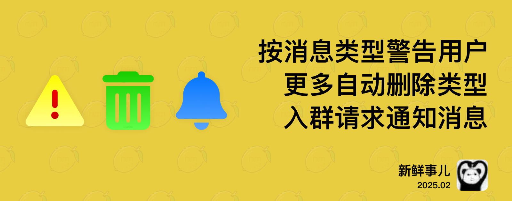

# nmBot 2025 年 2 月功能更新

## 新鲜事儿
### 按消息类型警告和更多优化——2025 年 2 月功能更新

今天我们推出乙巳蛇年的第一次 nmBot 功能更新。

#### 按消息类型警告用户

凭借独特设计的“无限警告次数”，nmBot 的警告功能提供了超多玩法。在我们发布 nmBot+ 时，“关键词回复”功能也接入了警告功能，使得对发送特定关键词的用户进行警告比以往更轻松。

本次更新的“按消息类型警告用户”是对警告功能设计理念的延续。它与“按消息类型自动删除消息”紧密集成，可在用户发送特定类型消息时，在删除时自动对用户予以警告。

此外，本次更新后，转发到群组的故事消息和更多服务消息也将支持自动删除。

#### 入群请求通知消息

不少用户都会选用 Telegram 内置的“审核加入请求”功能来控制新成员的加入。但如何告知申请的用户，他们的申请要在什么条件下才能得到满足呢？

通过新增的“入群请求通知消息”功能，群组对申请人有了直接的消息传达渠道。订阅 nmBot+ 的群组可设置对入群请求自动回复的消息模板，对申请加入群组的用户直接发送。“请提交内容到……”这样的消息将不再需要手动发送。

#### 操作简化和体验提升

现在，设置各类功能时，消息模板区块将自动收起，以便用户配置其他功能。

/config 功能也支持在私信中打开菜单，以免菜单内容干扰群成员聊天。

骚扰拦截争议的发起流程也得到优化，发起争议时，我们不再要求上传活跃度截图；发起的争议现在也将被更快通知处理。

## 2025 年 2 月 17 日 14:30

### <nmbot-plus-icon></nmbot-plus-icon> 按消息类型警告用户

- nmBot 支持在删除群组中特定类型消息的同时，对发送消息的用户予以警告。

### <nmbot-plus-icon></nmbot-plus-icon> 入群请求通知消息

- nmBot 可在有用户申请加入群组时，在私信中向该用户发送预设消息。

### 自动删除消息支持更多类型

- 支持在群组中自动删除故事。
- 支持在定时任务中设置自动删除故事。
- “自动删除服务消息”现在将删除群组助力消息、对话背景设置消息、话题关闭消息、话题重启消息。

### 自动折叠消息模板

- 为消息设置消息模板时，更多模板将默认隐藏。

### 其他改进

- 支持跳转到私信中使用 /config 菜单。
- 进行网页验证时，可以使用 hCaptcha 进行验证。
- Telegram 星币交易记录中，即日起的 nmBot+ 购买将显示 nmBot+ 图标。 
- 发起骚扰拦截争议时，不再要求用户提供三张证明活跃度的截图。
- 禁言和封禁等功能的返回消息中的按钮，现在仅发起警告的管理员可用以删除消息。
- 优化了 nmBot 面板“定时任务”设置页面中部分设置项的描述。

### 问题修复

- 修复了 nmBot 面板部分元素遮挡关系错误的问题。
- 修复了 nmBot 面板页面提示中文本错位的问题。
- 修复了 nmartChat 功能在特定情况下文本处理错误的问题。
