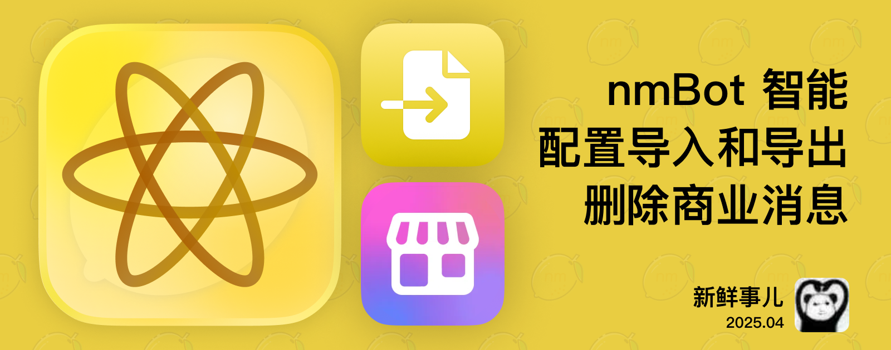

# nmBot 2025 年 4 月功能更新

## 新鲜事儿
### nmBot 智能上线、群组配置导入与导出——2025 年 4 月功能更新

为了庆祝生日月，除了首批 nmBot 智能功能 nmBot 智能聊天 (Beta 版) 外，我们还推出了群组配置导入和导出功能，并对商业关键词回复等功能进行了增强。

#### nmBot 智能 

nmBot 智能聊天 (Beta 版) 正式推出！您可以点击加入[等候名单](https://t.me/nmnmfunbot?start=intelligencewaitlist)。

“nmBot 智能聊天”是内置于 nmBot 和 nmBot 面板的个人助理，使管理 nmBot 群组和个人配置变得史无前例地简单。

有了“nmBot 智能聊天”，您只需要用自然语言描述目的，nmBot 智能便可以为您配置好相应的功能。例如，只需说“让新人必须得订阅我的频道 @nmbotchannel，而且加群第一天不允许发图片”，nmBot 智能就会知道您要启用“入群验证”和“新成员权限限制”两项功能，并为您配置好。

#### 配置导入和导出 (Beta 版)

期待已久的配置导入和导出功能即将与大家见面！您可以轻松导出群组管理功能、群组娱乐功能、关键词回复、锁定模式等配置，并导入到其他群组。您还可以导入 Rose 机器人的部分配置。群主还可以设置管理员是否可导入和导出群组配置。配置导入和导出功能将在几天内陆续向所有群组开放。

#### 商业关键词回复

对于 nmBot+ 订阅用户，商业关键词回复现已支持自动删除触发的消息和回复消息，并将消息标为已读，让您的商业对话管理更高效。

#### 更多改进

本次更新还带来了多项调整和优化。我们还修复了封禁操作提示消息链接预览错误、繁体中文搜索配置问题、代码和文本错别字等问题，并优化了关键词回复设置缓存清除和触摸屏操作体验。

## 2025 年 4 月 17 日 10:40

### nmBot 智能 (Beta 版)

- 推出首批 nmBot 智能功能 nmBot 智能聊天 (Beta 版)。即日起，用户可通过链接 https://t.me/nmnmfunbot?start=intelligencewaitlist 加入 nmBot 智能等候名单。nmBot 智能的使用权限将逐步开放。

### 商业关键词回复

- <nmbot-plus-icon></nmbot-plus-icon> 商业关键词回复现支持自动删除触发的消息和回复消息。
- <nmbot-plus-icon></nmbot-plus-icon> 商业关键词回复现支持将消息标为已读。

### 配置导入和导出 (Beta 版)

⚠️ 以下功能将逐步对所有群组开放。
- 支持将群组的群组管理功能、群组娱乐功能、关键词回复、锁定模式等部分其他配置导出。
- 支持导入以前导出的 nmBot 配置。
- 支持导出 Rose 机器人的部分配置。
- 群组的群主可在 nmBot 面板设置管理员是否可导入和导出群组配置。

### 其他改进

- 新增了骚扰拦截争议的办结提示文本。
- 调整了网页验证时验证消息的提示文本。
- 在 nmBot+ 权益列表中补充了“同频气氛组”功能的权益。
- 调整了 nmBot 面板部分元素的配色。
- nmBot 面板现在将提示使用 Internet Explorer 的用户更换浏览器。

### 问题修复

- 修复了封禁操作的提示消息中可能错误显示链接预览的问题。
- 修复了使用繁体中文时，nmBot 面板无法搜索配置的问题。
- 修复了 nmBot 代码和文本中的部分错别字。
- 修复了更新关键词回复设置后，既有缓存内容未能正常清除的问题。
- 修复了通过触摸屏方式打开 nmBot 面板的特定上下文菜单时未显示针对触摸屏优化的上下文菜单的问题。
