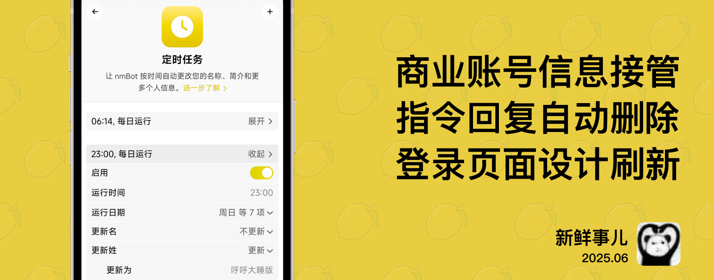

# nmBot 2025 年 6 月功能更新

## 新鲜事儿

### 商业定时任务、自动删除群组操作回复消息——2025 年 6 月功能更新

在 nmTeam 的生日月，我们为 nmBot 商业功能带来了史上最大的更新。

#### 商业定时任务

nmBot 的“商业关键词回复”功能赋予了商业用户自动回复收到私信的能力；在近期更新中，还获得了自动删除收到和回复消息的能力。

本次更新让 nmBot 的商业功能再次获得飞跃——推出“商业定时任务”功能，允许商业用户按照时间自动更改账号信息。例如，您现在可以在每天的工作时间将自己的名称自动改为“绝赞接单版”，在其他时间则设为“请勿打扰”。

#### 自动删除群组操作回复消息

您现在可以设置群组中的操作回复消息自动删除。例如，使用 /ban 等操作指令后，操作结果的反馈消息可以在一段时间后自动删除，更好地维持对话整洁。

您可以使用“操作记录”功能记录下操作，即使操作消息被删除，记录也能得到保存。

#### 更多更新

我们在该版本中还带来了其他优化，例如**全新设计的登录页面**更好地向用户介绍了 nmBot，同时使得登录流程更清晰；入群验证将**自动通过群组白名单中的用户**，使得群组管理员更好控制群组成员的加入。

## 2025 年 6 月 17 日 10:30

### 商业定时任务

- 新增“商业定时任务”功能：商业用户可通过 nmBot 定时修改自己的名称、个人简介、用户名。
- nmBot 面板“商业”页面新增“商业机器人状态”部分，用户可在此部分中快速确认个人账号与 nmBot 的链接状态。

### <nmbot-intelligence-icon></nmbot-intelligence-icon> 自动删除群组操作回复消息

- 新增“自动删除操作回复消息”功能：一段时间后自动删除机器人对部分群组操作的回复消息，例如禁言用户、设置群组白名单、设置默认话题等功能的回复消息。

### 全新登录页面

- 推出重新设计的 nmBot 面板登录页面，帮助用户更方便的登录 nmBot 面板并了解 nmBot 的功能特点。

### 其他优化与调整

- /te 指令现在支持将贴纸转换为表情。
- 优化了 /white 指令的说明。
- 优化了登录 nmBot 面板的速度。
- 在 nmBot+ 权益列表中更新了最近添加的新权益。
- 优化了入群验证“最大尝试验证次数”功能的说明，明确该功能仅考虑过去 1 个月内的验证情况。
- 入群验证将自动通过群组白名单中的用户。
- 由于技术原因，本次更新删除了 2024 年 7 月功能更新中群组操作记录“支持记录其他群组管理员对成员进行的权限操作”的功能，先前记录的权限变更在 nmBot 面板中将无法查询。若要查询相应数据，请联系 nmTeam 支持。

### 问题修复

- 修复了 nmBot 面板“自动删除”页面，警告发送自动删除类型消息的用户功能的描述文本错误的问题。
- 修复了在非 Telegram 迷你 App 中打开 nmBot 面板时，无法正确显示页面刷新率的问题。
