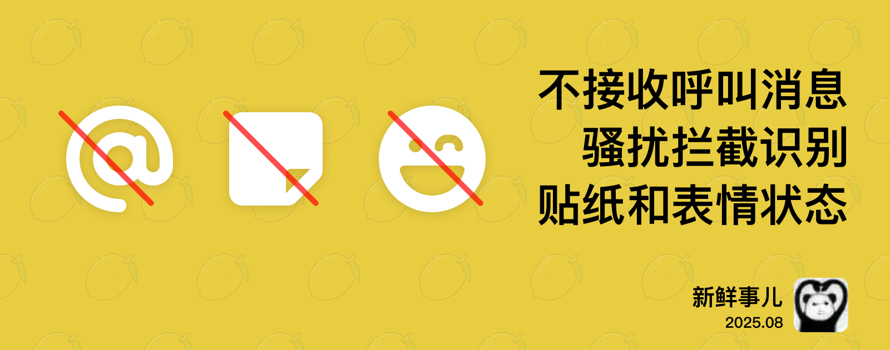

# nmBot 2025 年 8 月功能更新

## 新鲜事儿

### 呼叫管理员优化、骚扰拦截更精准——2025 年 8 月功能更新

在 8 月更新中，我们为呼叫群组管理员功能带来了新的通知选项，并为骚扰拦截功能和群组自定义规则添加了全新的识别模式。

#### 呼叫群组管理员

群组中有成员呼叫群组管理员时，nmBot 会通过私信或在群组中通知所有管理员。

若群组管理员不想被呼叫，现在可在 nmBot 面板的设置页面中选择不接收呼叫消息。这样，当群组成员呼叫群组管理员时，nmBot 将不再呼叫您。

此外，群组管理员现在还可在呼叫消息中直接将用户封禁并向 nmBot 举报。

#### 骚扰拦截支持表情状态、贴纸和引用对话

骚扰拦截功能现在支持贴纸消息、外部引用消息、消息所回复的对话，以及新入群用户的表情状态。当我们识别到引用内容、贴纸和表情属于骚扰消息，就会将该用户的操作判定为骚扰。

同时，使用自定义规则的群组也可将消息贴纸和表情状态所属的贴纸和表情包加入规则中。

#### 英文本地化优化

我们使用 nmBot 智能优化了 nmBot 和 nmBot 面板的英文本地化文本，让英文内容读起来更地道。

按照惯例，本次更新还带来了一些其他优化和修复。

## 2025 年 8 月 29 日 14:00

### 呼叫群组管理员

- <nmbot-plus-icon></nmbot-plus-icon> 用户可在 nmBot 面板“设置”页面中选择是否接收群组中的呼叫管理员消息。
- 呼叫管理员消息中支持将用户封禁并举报骚扰。

### 骚扰拦截

- 在入群验证功能中，“自动拒绝骚扰用户入群”功能现在将识别入群用户的表情状态。
- “骚扰消息拦截”功能现在将识别用户发送的贴纸是否为骚扰消息。
- “骚扰消息拦截”功能现在将识别用户发送的消息所引用的其他对话是否为骚扰消息。
- <nmbot-plus-icon></nmbot-plus-icon> 群组骚扰拦截“自定义规则”中可设置识别用户发送的贴纸所属贴纸包名称和入群用户的表情状态所属表情包名称。
- 群组骚扰拦截“自定义规则”设置页面添加了对用户简介和用户表情状态所属表情包名称的作用域的说明。

### 其他优化

- 为关键词回复“优先跨消息回复”功能添加了示意图。
- nmBot 面板“对话”页面中的排序方式选择器现在支持打开上下文菜单选择排序方式。
- 优化了新版“同频气氛组”对于图片帖子的处理，以缓解该功能的回复消息中包含图片描述的问题。
- 部分较早加入的 nmBot 功能在 nmBot 面板不再标记为“新功能”。
- 链接类型的 nmBot 面板设置项在被禁用时现在将显示为灰色。
- 改进了 nmBot 和 nmBot 面板的英文本地化文本。
- 优化了设置项中 nmBot+ 专属设置项的标识样式。
- 优化了 nmBot 面板高效手势操作指导的样式。

### 问题修复

- 修复了商业关键词回复设置页面“将消息标为已读”功能的说明文本中一处本地化字符串未正确呈现的问题。
- 修复了 nmBot 面板的页面加载指示器在特定情况下可读性不佳的问题。
- 修复了 nmBot 面板消息模板模块的“显示更多消息模板”按钮后方的遮盖区域大小不正确的问题。
- 修复了旧版和全屏迷你 App 兼容模式下，页面标题栏和页面标题显示位置未与中线对齐的问题。
- 修复了“自动删除指令消息”功能会意外删除特定非指令消息和关联频道消息的问题。
- 修复了快速滚动页面时，原先处于页面视口外的设置项，其图标颜色会闪烁异常的问题。
- 修复了部分消息类型的本地化字符串无法正确显示的问题。
