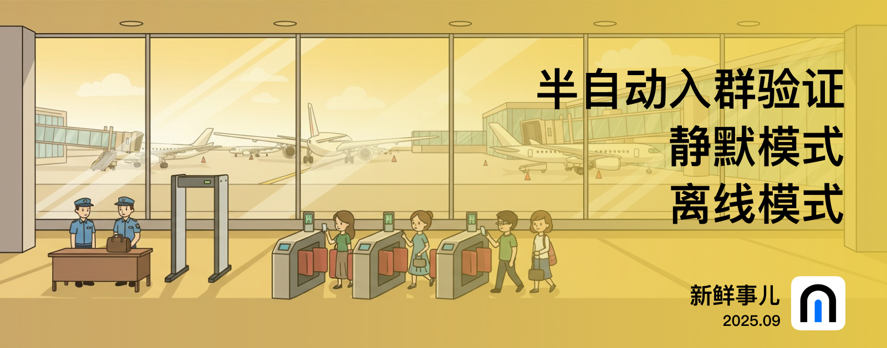

# nmBot 2025 年 9 月功能更新

## 新鲜事儿

### 紧急模式、半自动入群验证——2025 年 9 月功能更新

本月我们为 nmBot 带来了紧急模式，在应对群组突发状况时特别有用。

#### 静默模式和离线模式

“静默模式”将阻止 nmBot 向群组中发送所有消息，这样出现消息刷屏等情况时，就可以及时阻止。不过，“入群验证”等关键功能的消息也将停止发送，这可能导致新成员无法通过验证。

而“离线模式”将阻止 nmBot 处理群组中的任何事件，包括消息、新成员加入等。

#### 半自动入群验证

这是一种新的入群验证方式：新成员如果不符合预设的不通过验证的条件，则会自动进入等待队列，等待群组管理员审批其通过。这种模式与审核用户加入请求绝配。

与往常一样，这次更新还带来了更多优化。

## 2025 年 9 月 30 日 23:00

### 紧急模式

- 新增了两类群组紧急模式：“静默模式”和“离线模式”。
    - “静默模式”将阻止 nmBot 向群组中发送所有消息。“入群验证”等关键功能的消息也将停止发送，这可能导致新成员无法通过验证。
    - “离线模式”将阻止 nmBot 处理群组中的任何事件，包括消息、新成员加入等。
    - 启用紧急模式时，部分不基于群组事件的功能操作可能仍会执行。nmBot 会在群组中发送消息以告知该模式已启用。
    - 群组管理员可设置将紧急模式启用一段时间。
    - <nmbot-plus-icon></nmbot-plus-icon> 紧急模式可以在启用后手动中止。

### <nmbot-plus-icon></nmbot-plus-icon> 半自动入群验证

- 新增“半自动入群验证”：新入群用户若不符合群组设置的拒绝入群条件，即等待群组管理员手动审批。

### 其他更新

- “同频气氛组”功能现在将对无法回复的帖子发送提示。
- 更新了 PWA 模式下的 nmBot 面板 App 图标。
- 减小了 nmBot 面板和 nmBot 行内功能部分图片资源文件的体积以更快加载。
- nmBot 面板的底栏在内容超出范围时现在支持滚动。
- 群组关联频道的帖子将不再触发呼叫群组管理员功能。

### 问题修复

- 修复了“自动封禁退出群组的用户”功能不正常封禁在退出前被限制权限的用户的问题。
- 修复了 /config 功能的返回消息中，可能会错误显示链接预览的问题。
- 修复了 nmBot 智能聊天消息中，特定群组配置更改的选项设置名称显示不正确的问题。
- 修复了 nmBot 面板登录页面特定按钮缺少描述文本的问题。
- 修复了 nmBot 面板“管理”页面和对话快速切换器中，对话名称超出一行时，页面排版不正确的问题。
- 修复了使用英文时，nmBot 面板“管理”页面中，对话加载提示排版错误的问题。
- 修复了特定情况下，对话快速切换器中 nmBot 智能输入框中的文本超出范围的问题。
