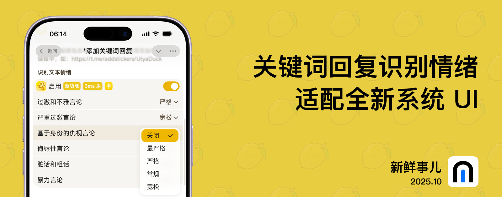

# nmBot 2025 年 10 月功能更新

## 新鲜事儿

### 关键词回复识别情绪、适配全新系统 UI——2025 年 10 月功能更新

万圣节快乐！本月我们为关键词回复和面板界面带来全新升级。

#### 关键词回复情绪识别

得益于 nmBot 智能，关键词回复功能现在支持识别消息文本的情绪。您可以识别基于身份的仇视言论、侮辱性言论、脏话和粗话、严重过激言论、暴力言论、过激和不雅言论，并执行所设置的操作。

#### iOS 26 和 iPadOS 26

运行 iOS 26 和 iPadOS 26 的受支持设备在 Telegram 迷你 App 中打开 nmBot 面板时，可体验到与系统风格接近的用户界面。我们重新设计了标题栏、导航栏和操作按钮，带来与系统其他地方更一致的体验。话虽如此，Liquid Glass 带来的高级的折射等效果还只有 Apple 能做到。

这个月我们同时做了其他更新，让 nmBot 使用起来更加完美。不给糖就捣蛋！

## 2025 年 11 月 15 日 16:30

nmBot 版本号：25.10.0-wine+6899.1000

- 修复了特定情况下群组配置无法正常加载的问题。

## 2025 年 10 月 31 日 19:55

### <nmbot-intelligence-icon></nmbot-intelligence-icon> <nmbot-plus-icon></nmbot-plus-icon> 关键词回复识别情绪 (Beta 版)
- “关键词回复”现可识别基于身份的仇视言论、侮辱性言论、脏话和粗话、严重过激言论、暴力言论、过激和不雅言论，并执行预设操作。

### 设备用户界面适配
- 运行 iOS 26 和 iPadOS 26 的受支持设备在 Telegram 迷你 App 中打开 nmBot 面板时，新的用户界面设计与新系统风格更适配，覆盖顶栏和底栏、页面菜单和输入工具条。

### 其他更新
- 为运行部分旧版本浏览器的用户添加了浏览器过时提示。
- 优化了 nmBot 面板部分页面标题区域的样式。
- 调整了 nmBot 面板对话管理页面的按钮列表。
- 优化了通过页面切换器切换页面的速度。
- 优化了 nmBot 面板频道配置页面部分选项的权限要求提示。

### 问题修复
- 修复了“锁定模式”页面列表中“系统模式”的“创建链接预览”功能未在图标列表中显示的问题。
- 修复了特定情况下触发高效手势后，手指移动时页面内容跳动的问题。
- 修复了特定情况下高效手势可在宽屏模式下触发的问题。
- 修复了在 Telegram 迷你 App 中打开 nmBot 面板时，活动弹窗的背景颜色覆盖区域错误的问题。
- 修复了在运行 iOS 26、iPadOS 26 或 macOS 26 的设备上在 Telegram 迷你 App 中打开 nmBot 面板时，页面滚动条可能显示不正常的问题。
- 修复了在运行 iOS 26 或 iPadOS 26 的设备上打开时，部分选项可能要连按两次才能工作的问题。
- 修复了特定情况下在 iOS 设备上在 Telegram 迷你 App 中打开 nmBot 面板时，键盘开启时输入工具条位置可能异常的问题。
- 修复了特定情况下退出“关键词回复”和“定时任务”编辑器后，编辑内容未正常清空的问题。
- 修复了使用英文时 nmBot 面板“商业”页面中商业机器人状态部分的文本不完整的问题。
- 修复了 nmBot 面板侧边栏中“nmBot 智能”选项的字体较其他选项更粗的问题。