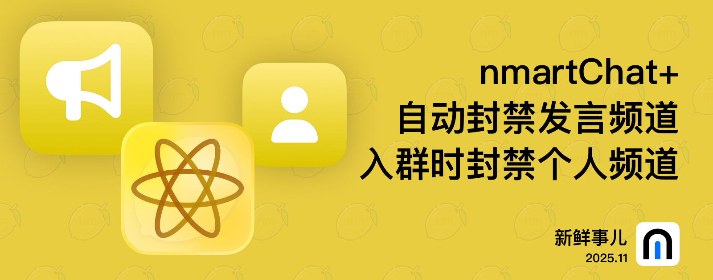

# nmBot 2025 年 11 月功能更新

## 新鲜事儿

### nmartChat+、频道封禁新升级——2025 年 11 月功能更新

本次更新带来 nmartChat+ 和针对频道发言的更多可选项。

#### nmartChat+

推出 nmartChat+ (Beta 版)，在保留一贯聊天风格的基础上，带来了对对话上下文的增强理解。

#### 频道身份发言新选项

自 2022 年起，群组管理员即可通过 nmBot 对以频道身份发送的消息进行限制。今天我们进一步扩大这项功能的可用范围。

通过我们新推出的封禁功能，在删除以频道身份发送的消息时，现在可同时封禁以频道身份发送消息的用户的频道，避免成员继续尝试以其他频道身份发言。

另一项开创性的新功能更使群组管理员受益匪浅——对于新加入的成员，在其开始使用频道身份发言前即可禁止其使用频道身份发言的权限。

此版本还增强了各项 nmBot 智能功能并修复已知问题，尽情体验。

## 2025 年 11 月 30 日 20:30

### <nmbot-intelligence-icon></nmbot-intelligence-icon> <nmbot-plus-icon></nmbot-plus-icon> nmartChat+

- 推出 nmartChat+ (Beta 版)。

### 自动封禁以频道身份发送消息的用户的频道

- 新增的“主动封禁入群用户频道”功能可在新成员加入群组时即尝试封禁其频道，避免成员尝试以频道身份发言。
- 在删除以频道身份发送的消息时，现在可同时封禁以频道身份发送消息的用户的频道，避免成员继续尝试以其他频道身份发言。

### <nmbot-intelligence-icon></nmbot-intelligence-icon> nmBot 智能

- nmBot 智能可帮助阻止“欢乐复读”功能发送意外消息。
- nmBot 智能聊天现可帮助创建识别情绪的关键词回复。
- nmBot 智能聊天现可通过将用户引导至“紧急模式”和“设置退群消息”页面来提供帮助。

### 其他更新

- 关键词回复“AI 智能生成”功能已弃用，该功能将在未来的版本更新中删除。
- 为“导入配置”和“导出配置”页面增加了页面标题。
- 保存消息模板失败时，现在将显示完整的保存失败原因说明。

### 问题修复

- 修复了特定情况下媒体组消息解析异常导致特定功能组件工作不正常的问题。
- 修复了特定情况下消息格式文本中的用户名称未正确转义的问题。
- 修复了使用英语时，nmBot+ 购买页面部分文本排版不正确的问题。
- 修复了特定情况下 nmBot 面板侧边栏中标题栏背景颜色不正确的问题。
- 修复了使用 Telegram 迷你 App 打开 nmBot 面板时，页面底栏下方的遮罩效果不正确的问题。
- 修复了使用 Telegram 迷你 App 打开 nmBot 面板时，对话页面的 nmBot+ 图标显示位置不正确的问题。
- 修复了群组语言和用户语言不一致时，nmBot+ 续期通知中部分文本内容以错误语言发送的问题。
