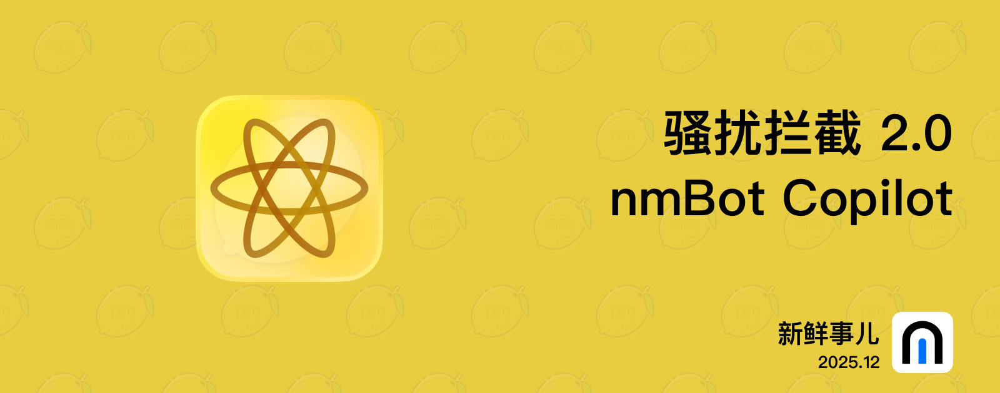

# nmBot 2025 年 12 月功能更新

## 新鲜事儿

### 骚扰拦截 2.0、nmBot Copilot——2025 年 12 月功能更新

各位新年快乐。这次更新携 nmBot 智能带来了全新升级的骚扰拦截功能和全新升级的 nmBot Copilot。

#### 骚扰拦截功能大幅提升

得益于 nmBot 智能，骚扰拦截功能的识别效果可提升至 5 倍*，同时保证我们一贯的低误封率。

群组管理员可自定义 nmBot 智能的灵敏度，还可根据消息的骚扰程度设定不同的操作。

#### nmBot Copilot

nmBot 智能聊天功能现更名为 nmBot Copilot。我们还对功能内部进行了全方位优化，使其在成本降低的同时还能更准确地响应用户要求。

另外，在接下来一段时间内，nmBot Copilot 将对大多数 nmBot 用户开放。

2025 年的最后一次更新就是这样，感谢大家一路对我们的支持。在 2026 年，我们还有几项酝酿已久的重量级功能，敬请期待。

\* 于 2025 年 12 月 22 日使用预发布版本的 nmBot 智能骚扰拦截组件进行测试。测试数据表明，在 nmBot 智能骚扰拦截设为“最严格”时，nmBot 智能骚扰拦截功能的识别效果可达传统识别的 5.11 倍。实际效果因使用情况和设置而异。

## 2025 年 12 月 31 日 20:47

### <nmbot-intelligence-icon></nmbot-intelligence-icon> 骚扰拦截 2.0

- nmBot 智能现可驱动骚扰拦截功能，将骚扰拦截效果提升约 5 倍。
- 群组管理员可以设置是否启用 nmBot 智能骚扰拦截功能，并设置其灵敏度。
- nmBot 智能骚扰拦截功能设为“删除”时，可启用“nmBot 智能智能操作”，通过消息的骚扰程度自动决定是仅删除消息还是封禁用户。

### <nmbot-intelligence-icon></nmbot-intelligence-icon> nmBot Copilot

- nmBot 智能聊天已升级为 nmBot Copilot。
- 优化了 nmBot Copilot 的工具调用，以增强其准确性并降低成本。
- 在接下来一段时间内，nmBot Copilot 将对大多数 nmBot 用户开放。

### 其他优化

- 添加了 Cloudflare Turnstile 作为默认的网页验证方式。Google reCAPTCHA 将在明年年初被弃用。
- 在群组中呼叫群组管理员时，若回复的消息为群组绑定频道发送的帖子，对回复消息的操作选项将不会展示。
