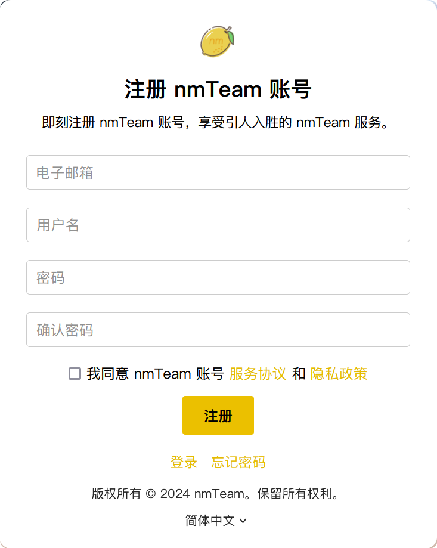

# 注册 nmTeam 账号
## 打开 nmTeam 账号中心
点击此链接打开“注册账号”页面：[https://accounts.nmteam.xyz/#/register](https://accounts.nmteam.xyz/#/register)

或在 nmTeam 账号中心登录页面，点击页脚的“注册”链接。

nmTeam 账号注册页面看起来像这样：

## 输入注册信息
要注册 nmTeam 账号，您需要提供电子邮箱并输入密码和用户名。

- 电子邮箱：输入您的电子邮箱地址。
- 用户名：输入您的用户名。
- 密码：输入您的密码。
- 确认密码：再次输入您的密码。

随后，请在阅读后选中“我同意 nmTeam 账号服务协议和隐私政策”。
注册 nmTeam 账号即表示您同意遵守 nmTeam 的服务协议和隐私政策。

确认您的注册信息无误后，点击“注册”按钮。

## 完成注册
注册成功后，系统会发送一封验证邮件到您的邮箱。
请查看您的邮箱，点击邮件中的链接以验证您的邮箱。
若您未收到验证邮件，请检查您的垃圾邮箱。
若需要帮助，请联系 nmTeam 支持。

## 解决问题
您在注册 nmTeam 账号时可能会遇到以下提示：

| 提示信息 | 原因 |
| :--- | :--- |
| 请输入用户名。 | 您未输入用户名。 |
| 请输入电子邮箱。 | 您未输入电子邮箱。 |
| 请输入密码。 | 您未输入密码。 |
| 请输入确认密码。 | 您未输入确认密码。 |
| 两次输入的密码不一致。 | 您两次输入的密码不一致。 |
| 请阅读并同意 nmTeam 服务协议和隐私政策。 | 您未阅读并同意 nmTeam 服务协议和隐私政策。 |
| 出现错误，可能是网络问题。请检查您的网络连接后重试。 | 无法连接到 nmTeam 服务器。请检查您的网络连接，或确认 nmTeam 账号服务的系统状态。 |
| 此用户名已被使用。 | 您输入的用户名已被其他用户注册。请尝试其他用户名。 |
| 此电子邮箱已被使用。 | 您输入的电子邮箱已被其他用户注册。请尝试其他电子邮箱。 |
| 电子邮箱格式不正确。 | 您输入的电子邮箱格式不正确。请检查您的电子邮箱格式。 |
| 昵称格式不正确。 | 您输入的用户名格式不正确。请检查您的用户名格式。 |
| 输入的密码不符合要求。| 您输入的密码不符合 nmTeam 的密码要求。请参考密码要求重新输入密码。 |
| 注册失败。 | 请联系 nmTeam 支持以获取帮助。 |
