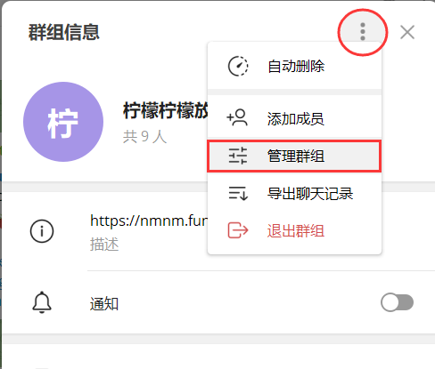
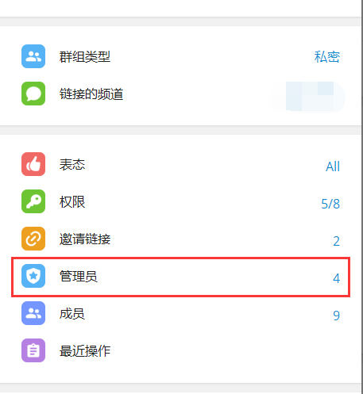
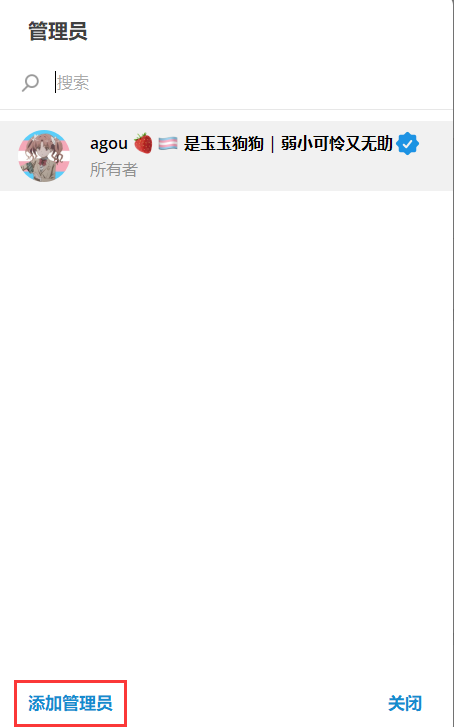

# 授予 nmBot 管理员权限并配置功能

nmBot 管理功能仅在授予 nmBot 必要的管理员权限后可用。  

若要使用 nmBot 管理功能，请为 nmBot 授予删除消息、Ban 用户、置顶消息（如果需要）等权限。  

若 nmBot 已拥有管理员权限，拥有更改群组信息权限的管理员可使用 /config 命令打开 nmBot 设置菜单以启用和关闭 nmBot 功能。  

>💡 启用“管理功能”后，才可以控制 nmBot 聊天功能（nmartChat）的开启和关闭。  

>💡 启用“管理功能”后，nmBot 将响应 /ban, /block, /pin 等群组管理命令。

## 在 Telegram 中授予 nmBot 管理员权限

>💡 您需要是有添加管理员权限的群组管理员，才能授予 nmBot 管理员权限。

以 Telegram Desktop 为例说明操作方法，您可以参考以下步骤设置。

第一步：打开群组信息页面，点击右上角的菜单按钮，然后选择“管理群组”(Manage Group，根据翻译不同可能有所区别，下同)。

第二步：选择“管理员”(Admins)选项。

第三步：点击“添加管理员”(Add Admin)按钮。

第四步：搜索并点击“nmBot”选项。

第五步：确保至少选中了“删除消息”(Delete Messages)和“封禁用户”(Ban Users)权限，然后选择保存。

## 将 nmBot 添加为管理员

您可以在添加 nmBot 到群组时，直接设置 nmBot 为管理员。

>💡 您需要是有添加管理员权限的群组管理员，才能通过这种方式添加 nmBot。

>💡 若要在 Telegram 官方翻译平台关联群组使用 nmBot，必须通过这种方式来初始化。

以 Telegram iOS 版为例说明操作方法，您可以参考以下步骤设置。

第一步：打开 nmBot 个人信息页面，在菜单中选择“添加到群组或频道”(Add to Group or Channel，根据翻译不同可能有所区别，下同)。

第二步：选择需要添加 nmBot 的群组。

第三步：在弹出的对话框中，确保打开“管理员权限”(Admin Rights)并选中了“删除消息”(Delete Messages)和“封禁用户”(Ban Users)权限，然后选择“添加机器人为管理员”(Add Bot as Admin)。

