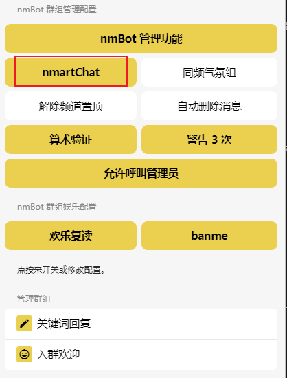

# nmartChat 智能聊天

> **nmartChat , 好聊又好撩。**

用户可以在私信和群组（如果群组管理员保持该功能开启）中与 nmBot 展开智能聊天，只需要发送以 nm 开头的消息，或回复 nmBot 的消息即可。

## nmartChat 注意事项

- nmartChat 仅在**简体中文**环境下工作。

- nmartChat 不会公开用户发送给 nmartChat 的消息，除非相关 API 返回的消息中含有源消息。

- nmartChat 可能使用第三方服务，nmartChat 发送给这些服务的信息中不会包含用户的账号信息。  

### nmartChat 贴纸回复逻辑

nmBot 在收到私信和打开 nmartChat 功能的群组回复的贴纸消息时，将回复贴纸。  

具体回复逻辑如下：

- nmBot 有 30% 概率回复同一张贴纸。
- 若 nmBot 未回复同一张贴纸，则在设置了群组贴纸包的群组中有 50% 概率随机（无排除）抽取该贴纸包一张贴纸回复。
- 若 nmBot 仍未回复贴纸，则将从收到贴纸的贴纸包中随机（无排除）选择一张贴纸回复。

## 群聊中如何开启 nmartChat

您可以在 [nmBot 面板](./launch-panel.md) 中开启此功能，但您必须为此群聊的管理员。  
具体步骤如下：

1.遵循 [启动 nmBot 面板](./launch-panel.md) 中的步骤，进入 nmBot 面板。

2.选择您要开启 nmartChat 的群聊。  

!!! faq "没有在面板中找到您的群聊 ?"
    您必须为此群聊的**管理员** , 且需要在群内发送 `/regadmin @nmnmfunbot` 注册您的群聊。
    

3.在群聊设置中开启 nmartChat 功能。(按钮为柠檬色即为开启。)  
   

!!! faq "为什么在频道（或在群聊内使用频道身份）发送以 nm 开头的消息，nmBot 不回复我?"
    请注意：nmartChat 仅支持与个人身份的用户进行对话，并不支持频道身份。  
    如果您需要在频道内使用 nmartChat，可以试试 nmBot 的 [“同频气氛组”](./group/reply-channel.md) 功能。
